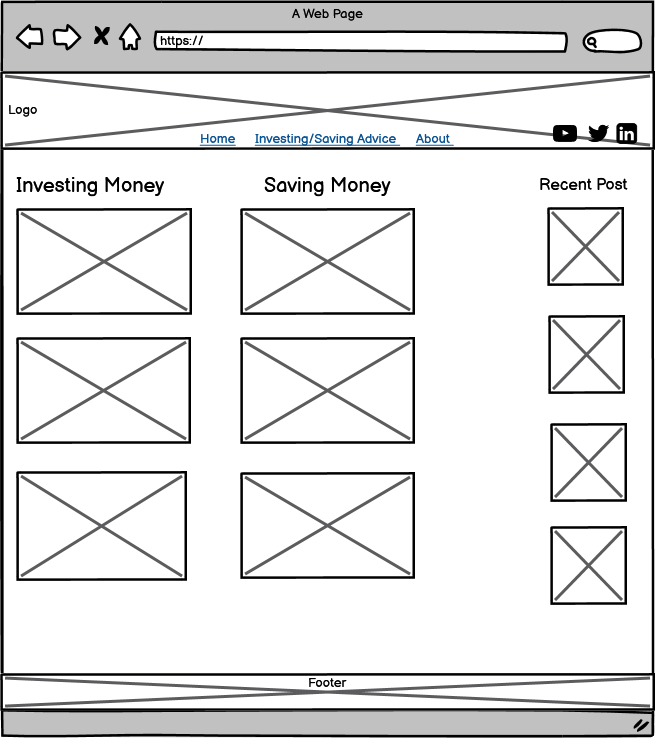
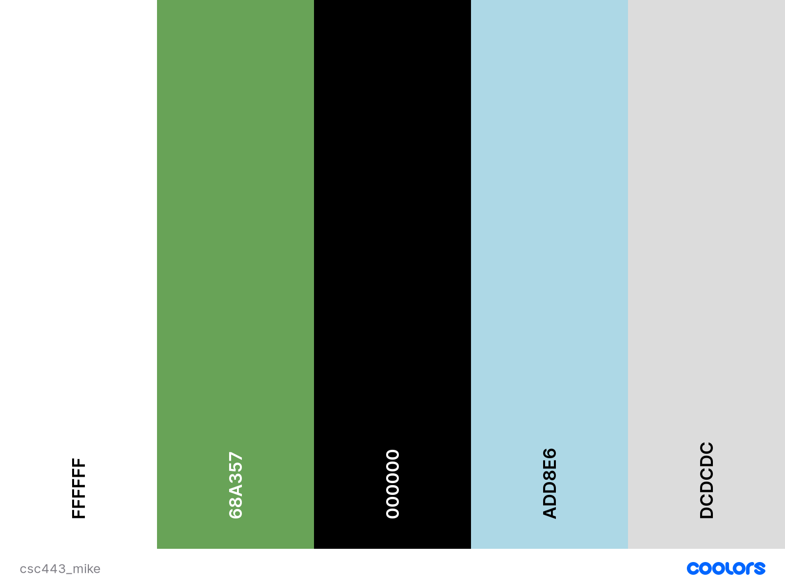

# Design Plan - MillenialMoney

## Page Wireframes

 
 

 
 

 
 

## Site Map 
This site will have 4 pages. The main page will be the home page. The user will be able to get to all pages though the nav bar which will be located at the top of each page. 
 

## Color Scheme

The color scheme I'm looking to use for this website is very minimalistic. I don't want the colors to be to bright and flashy, I want to keep the colors light and use colors such as white or grey. I want the user to feel relaxed when they are using the website. For this I used a hex colors #FFFFF
#68A357
#000000
#ADD8E6
#DCDCDC

