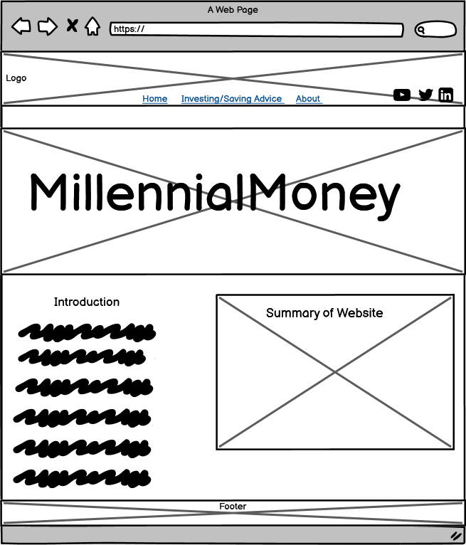
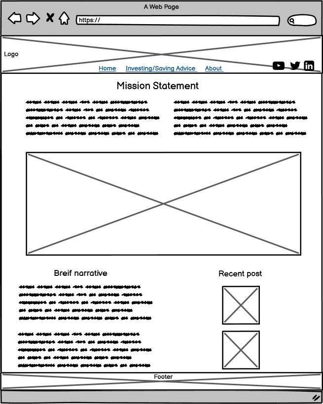
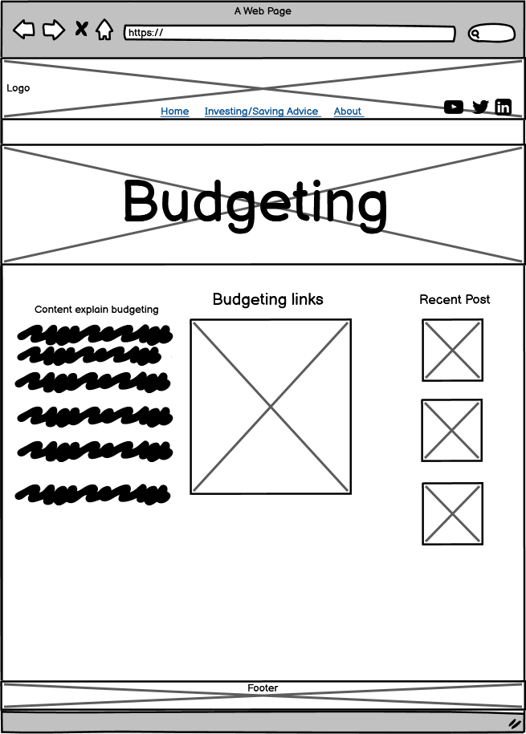

# Design Plan - MillenialMoney

## Page Wireframes
Provided below are the wireframe diagrams of the proposed web application. I wanted to keepo the website as  minimalistic and simple as possible. I want also wanted web application to be easy to use. The wireframe is designed for a larger web screen but will have the abilty to adapt to smaller screens. The investing/saving advice page will contain links to good articles, there will also be away to see the most recent articles put up on the site as well.

 
 

 
 

 
 

## Site Map 
This site will have 4 pages. The main page will be the home page. The user will be able to get to all pages though the nav bar which will be located at the top of each page. 
 

## Color Scheme

The color scheme I'm looking to use for this website is very minimalistic. I don't want the colors to be to bright and flashy, I want to keep the colors light and use colors such as white or grey. I want the user to feel relaxed when they are using the website. For this I used a hex colors #FFFFF
#68A357
#000000
#ADD8E6
#DCDCDC

