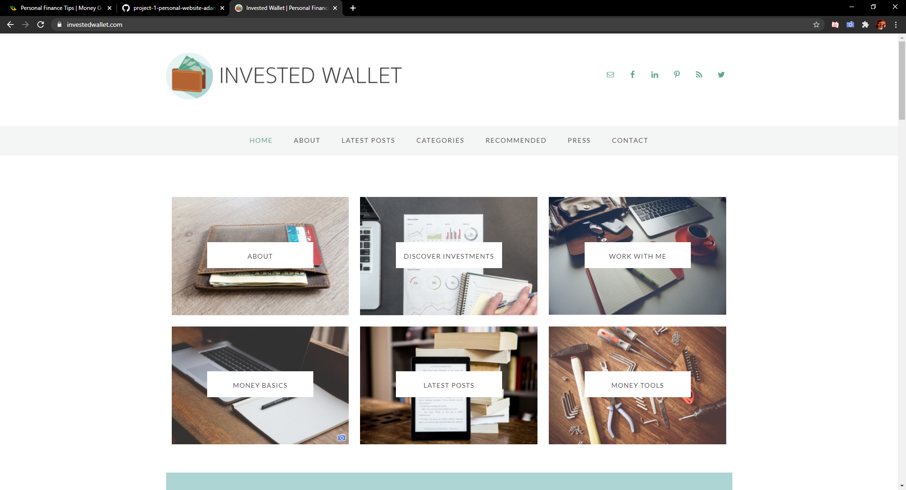
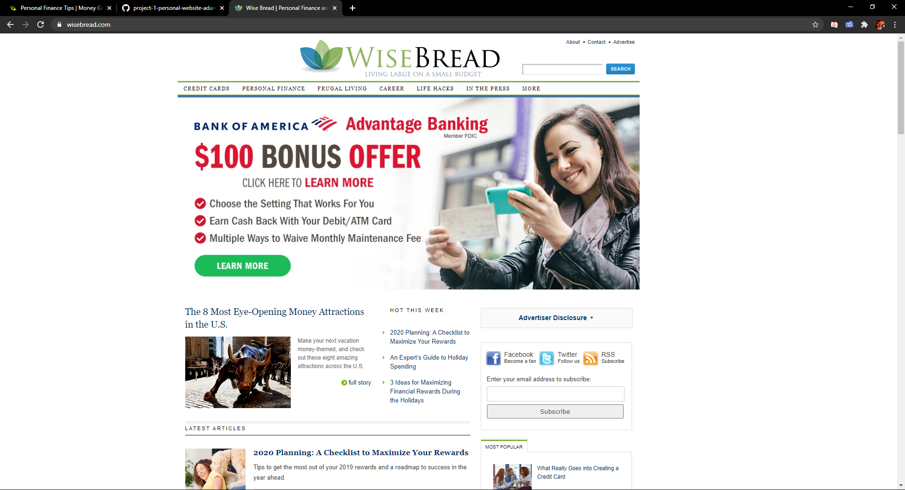
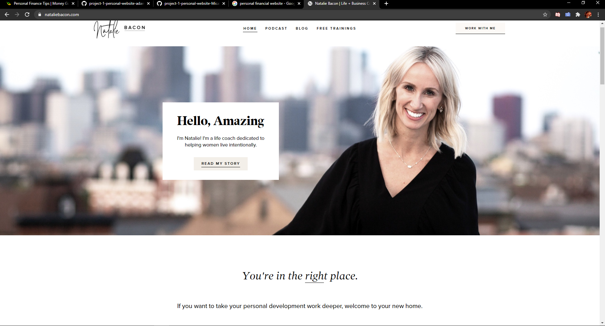

# Site Plan - MillennialMoney

## Overview

The mission of *MillennialMoney.com* is to offer young adults and adolescents advice on their finances. Millennialmoney will be designed around giving easy to understand advice to young kids and young adults on money-saving techniques and economical lifestyle tips. 

Money is everywhere. You can’t escape it. Unfortunately, personal finance is not a required subject in most high schools or colleges. The lack of basic financial education leaves many young adults clueless about how to manage their money, applying for credit, and how to get or stay out of debt. Many people are left at a disadvantage when entering the real world  

This website will remain static in nature and will be built from the bare bone up. The website will consist of several pages that each have some kind of of simple and easy to understand advice about how to take care of your personal finances.  

## Goals

The primary goals are of the site are given below:

### Breaking Down Spending Habits
* Helping users learn how to track spendig
* Exploring How to deal with loan debt
* exploring if you should own a credit card
### Help Users Learn About a Zero Based Budget
* Learning how to set a budget for each month 
* Learning how to make an emergency fund
* When is the best time to start invest/saving for retirement 
### Promote My Professional Social Profiles
* Allows the able to self promote 
* Allows viewers to see other social media sites where I talk about the important of learning financial literary at a young age. 

## Target User

The target users are young adults who want to learn more about what to do with their money and how to save and invest it. 

### Jacob - Highschool Student

jacob is a 17 year-old highschool junior who just got his first job. He wants to learn how to make the most out of the small amount of money he is earning and looking for a advice for how he can make the most out of each paycheck 

He is visiting my page to soak in as much knowledge as he can get and find out more ways that he can be smarter with the money he's earning. Jacob is taking the first step in learning about financial literary 

### Mary - College Student

Mary is 22 year-old college senior who's decided to move out of her parents house and live on her own for her last year of college. She had been saving most of her paychecks in prepartion for moving out. 

Mary has notice the money she has saved is depleting much quicker then she thought it would and is looking for finacnal advice on how to budget her spending.

She likes what my website has to say and follows me on other social media sites via links on website page to keep up with more of my daily conent on how to be more financially literate. 

## Content 

### Home

This will be the page user see when I first arrive on the site. The home page won't contain a lot of information. It will have my name, the idea behind wanting to create the wesite, and my mission for the site along with a with a few pictures

### About 

Page will contain a brief narrative about myself. It will contain some information about my professional life as well. 

### Budget Breakdown page
 This page will stress the important of learn what a budget is and how it can be used to help you see where/how your money is being spent

### investing Advice 

This page will contain information on how to make small but smart and easy investments. The point of this page it to show young peolpe it not complicated make to  smart long term investment to further ther financal status.

### Contact Informtion 

Contact information will allways be availbe in the nav bar. I want the contact information to be visible to the user and easy to access. 

## Similar Sites 

### investedwallet.com 

* *investwallet.com* is a site I was researching and found it to be super informative and easy to follow. The nav bar is simple top follow and easy to navigate. I liked how the contact information was easy to follow and accessible on every page. The website provides good information that is helper to the user and isnt just fluff. I also like how simple athe home page was, nice quality picutes used and not hard to understand how to use.  

 

### wisebread.com
 
* *wisebread.com* is another site with alot of good information about how to save money and also what to do with the money you have saved. I really like all the good information that was given on the site. I personally found the site design to be a little busy and kind of boring. But its site itself isn't hard to follow and allows the user to get good information on how to use and save their money wisely

 

### nataliebacon.com

* Natalie has an easy to follow site with great design. I want to have a design similar to her site. It is clean and very simple look while being easy to navigate. 

 

### Conclusion 

* I really liked both sites but feel that wisebread's site wasn't as appeasing to look at as investedwallet. I liked how both sites gave easy to understand information. I want to incorporate easy to follow/understand information in my site and will follow something similar to their sites. Easy to follow info is important to me since my site will be for young kids and adults and I dont want the information to be to complex and hard to follow. The same goes for my design, My design will be very simple. I really liked the design/look of *nataliebacon.com*. Natalie created an easy to follow site with great design and picutes.

